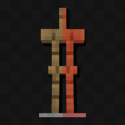

# ClientSideHurtAnimations

Adds client-side hurt animations when attacking entities

## Customization

- **Enable on Players**: Enable client-side hurt animations for players.
- **Only Enable on Real Players**: Only enable client-side hurt animations for real players (UUID version == 4).
- **Enabled on Other Entities**: Enable client-side hurt animations for other non-player entities, such as zombies.

## Dependencies

- [Fabric API](https://modrinth.com/mod/fabric-api)
- [YetAnotherConfigLib (YACL)](https://modrinth.com/mod/yacl)
- [Mod Menu](https://modrinth.com/mod/modmenu) to reach the config screen (please do it)