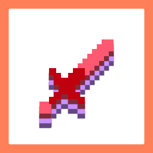

# ClientSideHurtAnimations

Adds client-side hurt animations when attacking entities

## Dependencies

- [Fabric API](https://modrinth.com/mod/fabric-api)
- [YetAnotherConfigLib (YACL)](https://modrinth.com/mod/yacl)
- [Mod Menu](https://modrinth.com/mod/modmenu) to reach the config screen (please do it)